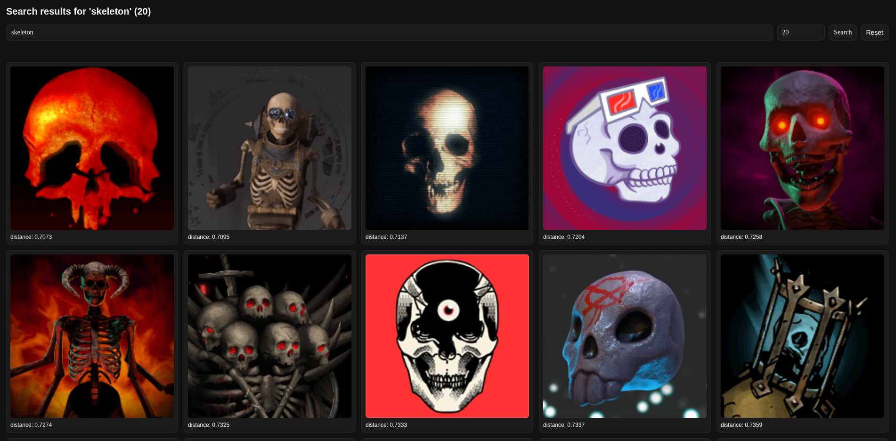

# Steam Avatars Search Engine

Semantic search for Steam avatar GIFs using CLIP embeddings, ChromaDB, and a FastAPI UI.

## How it works

1. Avatar URLs live in `avatars.csv` (create or harvest separately; the file is gitignored if you add your own).
2. The indexing notebook downloads images, embeds them with CLIP, and stores vectors in Chroma.
3. The web app embeds query text with the same CLIP model and runs nearest-neighbor search against the collection.
4. The UI serves files from `images/` and falls back to per-item `url` metadata when needed.

## Example



## Layout

| Path | Role |
|------|------|
| `embeddings.ipynb` | Download, embed, and index avatars into Chroma |
| `steam_avatars_db/` | Persistent Chroma data (collection `steam_avatars_collection`) |
| `images/` | Local image cache used by the app |
| `web/` | FastAPI application and `config/search.yaml` |
| `harvest_avatars.py` | Optional helper to collect URLs |

## Environments

Indexing and the web stack use separate virtualenvs.

**Notebooks / indexing**

```bash
python -m venv venv-notebooks
source venv-notebooks/bin/activate
pip install -r requirements.txt
```

**Web app**

```bash
python -m venv web/venv-web
source web/venv-web/bin/activate
pip install -r web/requirements.txt
```

Download CLIP weights once with network access (Hugging Face cache under `~/.cache/huggingface`).

## Build or refresh the index

1. Activate `venv-notebooks`.
2. Run `embeddings.ipynb` from top to bottom with `avatars.csv` and output paths as expected by the notebook.
3. Confirm `steam_avatars_db/` updates and images exist under `images/`.

## Run the web app

```bash
source web/venv-web/bin/activate
cd web
uvicorn app.main:app --reload --port 8001
```

- Gallery: [http://127.0.0.1:8001/](http://127.0.0.1:8001/)
- Search example: [http://127.0.0.1:8001/?q=skeleton&n=20](http://127.0.0.1:8001/?q=skeleton&n=20)

## Configuration

Create `web/.env` (optional overrides):

- `PROJECT_NAME` — browser title / app label  
- `SEARCH_CONFIG_PATH` — path under `web/` to the search YAML (default: `config/search.yaml`)

Chroma **HNSW** options for the collection are read from that YAML. Example keys: `space`, `ef_construction`, `max_neighbors`, `ef_search`, `num_threads`, `resize_factor`, `batch_size`, `sync_threshold`. If `num_threads` is omitted, the app uses a CPU-based default (capped at 8). Changing graph-related values after data is indexed may require rebuilding the collection; see comments in `web/config/search.yaml`.

## Troubleshooting

- **Search errors** — Ensure the web venv is installed, Chroma DB path matches the app (`steam_avatars_db` at repo root), and CLIP weights exist locally (offline mode is enabled in the app).
- **Missing thumbnails** — Ensure `images/` exists at the repo root and metadata URLs are valid if you rely on fallback.
